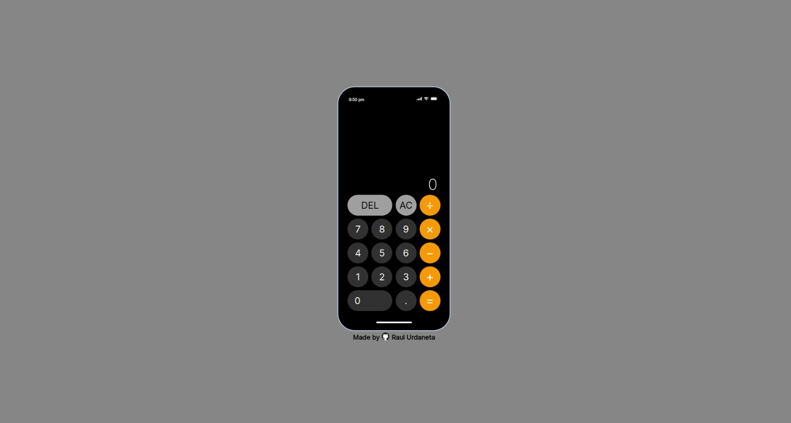

# calculator-app

# Learnings

- Learned hot to style buttons the way i want, round buttons, round enlarged buttons, and color changing.
- Used grid to create a keyboard, an modified specific items of the grid to occupy more columns and rows.
- Learned how to get date and hour from the client to use it in text or functions.
- Learned to get the text content from the buttons.
- Learned to format numbers, if the number is integer show no decimals, an if it has decimals show upt to 4 decimals.
- Learned to compare to an Infinity result.
- Used a buffer for the first time to store the previous operation symbol.
- Used array methods like filter, join or pop for the first time.
- Used string methods like split.

[Live Preview](https://raulurdanetag.github.io/calculator-app/) 👈
